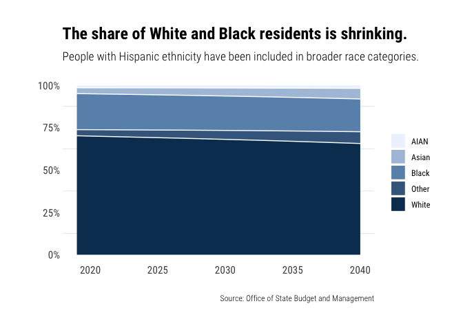

README
================
Sam Sloate
4/7/2022

# Executive Summary

This final project is completed for Duke’s GLHLTH562: Data Visualization
in R. It is an extension of a larger Master’s Project being completed
for Duke’s Master of Public Policy Program.

### Masters Project Background

For my Masters Project, the North Carolina Office of State Budget and
Management (OSBM) asked my team and I to create a microsimulation model
to predict future personal income tax revenues based on projected
demographic trends.

Microsimulation models use data on individual households or people to
model individual characteristics over time. Microsimulation allows
researchers to understand how small tweaks can influence important
outcomes, like tax revenue. In our static microsimulation model, the
2019 and 2040 datasets contain the same list of observations. To
simulate increases and decreases in the projected number of people with
a given set of characteristics, the model adjusts the weights of each
observation.

### Research Question

My general research questions are:

**How are demographics and incomes projected to change over time in
North Carolina?**

**How will these changes affect North Carolina’s income tax liability in
2040?**

### Dataset

The dataset for this project comes from original analysis performed on
the the Census’ Current Population Survey (CPS) and North Carolina
demographic projections from the state demographer. Because the CPS does
not include data on high income earners, capital gains, or tax
exemptions, we also use supplemental data from OSBM on the number of
people with (and value of) these characteristics.

The basic steps to our external analysis include:

1.  **Assemble a base dataset** with observations that include each
    individual or household’s demographic (i.e., race, ethnicity, age,
    and sex) and income information. Impute missing variables using
    supplemental OSBM data.

2.  **Weight the observations** in the dataset, such that the weight
    indicates the number of individuals each observation represents.

3.  **Calculate future weights**for each year of the projection period
    based on predicted future demographic composition.

4.  **Grow incomes expenditures** to account for inflation and rising
    salaries.

5.  **Project income expenditures** by applying weights for each year in
    the projection period to baseline observations.

6.  **Apply tax calculators** to the projected incomes to estimate
    income tax liability and consumption taxes paid for each
    observation.

The final dataset used in this visual analysis contains data on the
value of income components and adjusted net tax liability for every
observation (row) in the data, 2019-2040. Each observation represents
many people as indicated by that observation’s weight. I also use
datasets with the same structure, but that represent differnt
sensitivity analysis scenarios. These scenarios are:

1.  Changes in income growth (+70% growth rates and 3% inflation, -70%
    growth rates and 1% inflation)

2.  A stable tax rate (5.25% for all years)

3.  A stable standard deduction (between $10,750 \[single\] and $21,500
    \[married\] for all years)

4.  No demographic shifts (increases the population to 2040 levels but
    increases all age and race groups proportionally)

These sensitivity analysis will highlight which parts of our model are
most influential on tax liability.

## Methodology

As noted above, the majority of my modeling methodology was performed
externally in Python. The analysis methodology for this project was as
follows:

1.  Clean OSBM’s population projections and graph the trends in total
    population and by race and age groups.

2.  Clean and graph the model projections of income components from
    2019-2040 (i.e. wage income, business income, unemployment income,
    etc.).

3.  Clean and graph the model projections of tax liability from
    2019-2040.

4.  Clean and graph the model projections of tax liability in each of
    the sensitivity analysis scenarios outlined above.

### Findings

#### **Question 1: How are demographics and incomes projected to change over time in North Carolina?**

##### *Demographics: Age*

This analysis showed that the North Carolina population is projected to
increase by 22% from 2019-2040, from 10.4 million to 12.7 million.
Proportionally, the population will be getting older, less White, and
less Black. Demographers are predicting that the number of people under
aged 25 will go from 32% of the population in 2020 to 28% in 2040,
whereas those over aged 65 will go from 17% in 2020 to 21% in 2040.

##### *Demographics: Race*

Demographers are also predicting that the percentage of White and Black
people will decline, from a combined 91% of the state population in 2020
to only 85% in 2040. People of Asian and “Other” races will nearly
double over this time, from about 3% to about 6% each.

##### *Incomes*

Nominal incomes are expected to more than double in the next twenty
years, from $344B in 2020 to $825B in 2040. Wages are the main component
of total income, representing $625B of the total $816B in 2040 income.

#### **How will these changes affect North Carolina’s income tax liability in 2040?**

##### *Tax Liability*

State tax liability is projected to be $19.8B in 2040, up from $11.6B in
2020. Decreases in the tax rate from 2022 to 2027 keep projected
liabilities flat until 2028. As seen in sensitivity analyses, income
growth is the main driver of this increase. Furthermore, specific
demographic shifts do not significantly impact tax liability. If all age
and racial groups in 2040 represented the same percentage of the
population that they did in 2019, tax liability would only be 0.2%
lower. Thus, general population and wage growth are the biggest drivers
of future tax liability in North Carolina.

